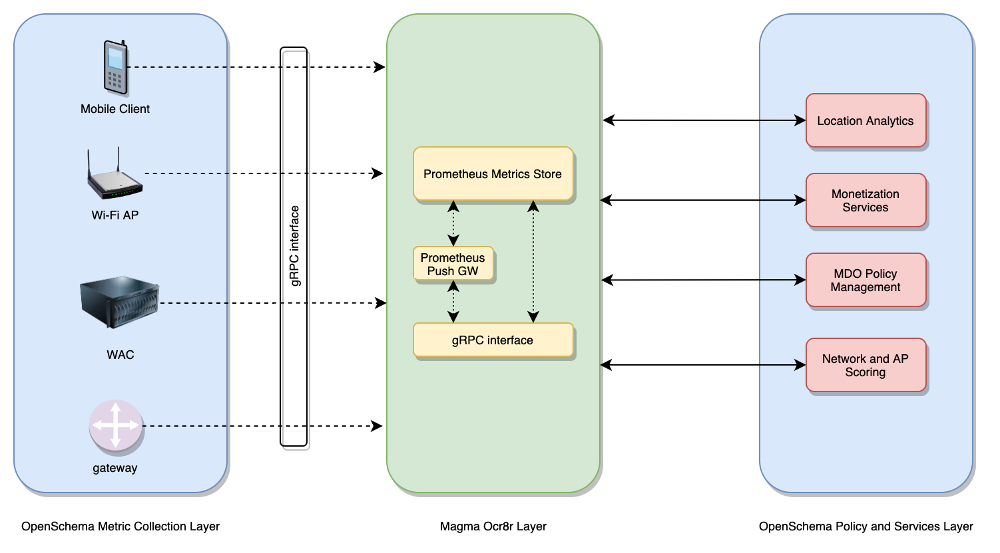

OpenSchema is a unified, plug and play model to identify, collect, store and retrieve metrics and statistics from different elements of the Carrier Wi-fi System. Following is the overview of different OpenSchema Components:

**Schema Definition:**
Schema definitions are the building blocks of OpenSchema. They are  collections of protocol files that define available metrics and stats that can be collected from different elements of the carrier Wifi system.

**Agents:**
Agents are software components that will sit on different elements of WiFi network and collect metrics using schema definitions and facilitate metrics upload to Metrics cloud.

**Magma Metrics Cloud:**
Metrics Cloud is a common metrics collection and datastore accessible by different elements of the Carrier WiFi system using Agents. Magma Metrics Cloud is implemented using Prometheus metrics collection.

**Interfaces:**
Metric Cloud implements different interfaces for Agents to connect, send or receive metrics from the datastore.

## Architecture
Picture below is the high level OpenSchema architecture.

